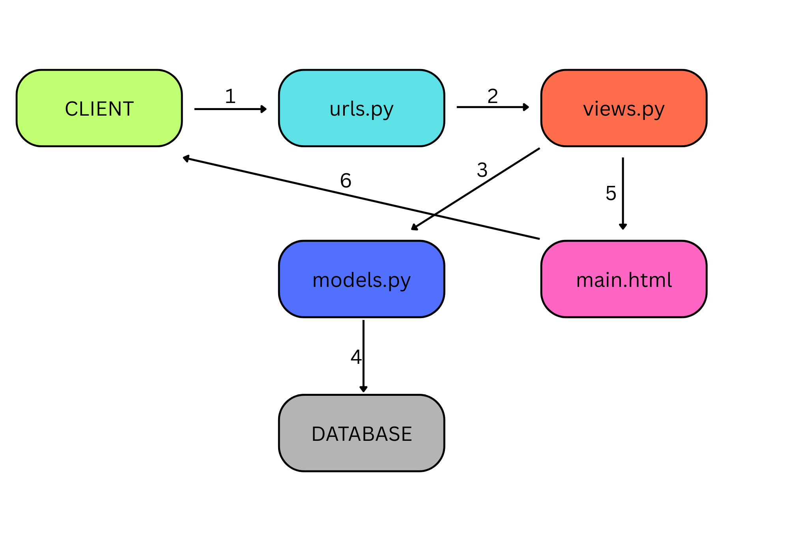
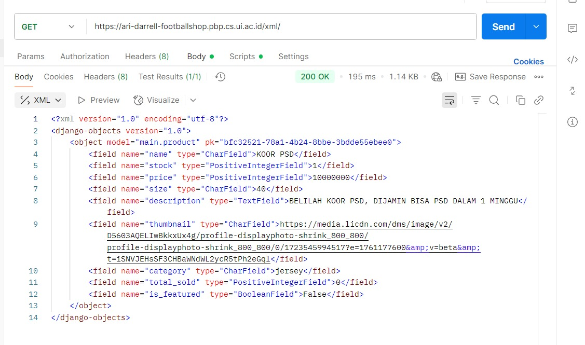
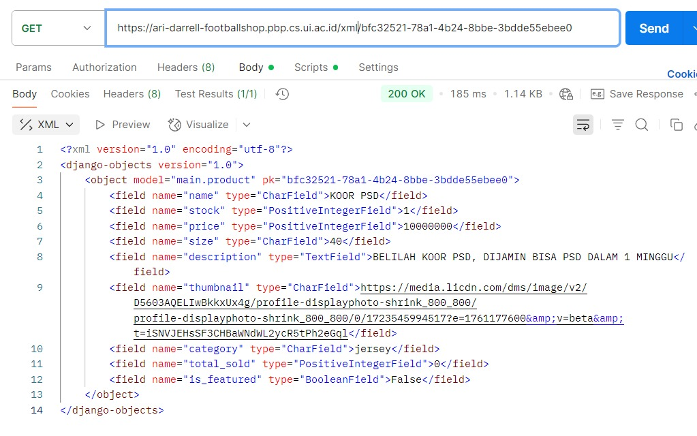
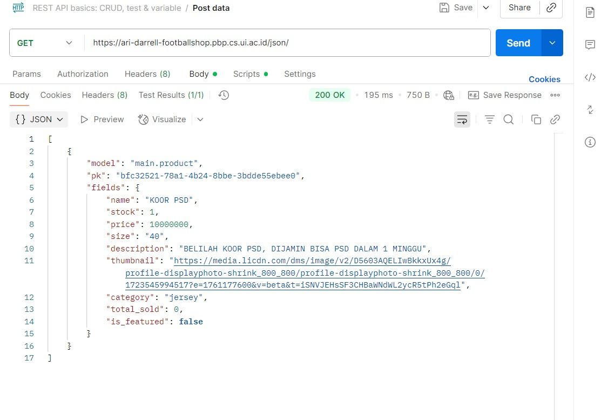

# pbp-c-adadis
<b>1. Jelaskan bagaimana cara kamu mengimplementasikan checklist di atas secara step-by-step (bukan hanya sekadar mengikuti tutorial).</b>

Untuk mengimplementasikan checklist tersebut, langkah pertama yang saya lakukan adalah membuat proyek Django baru menggunakan perintah django-admin startproject <nama_proyek>, kemudian saya masuk ke folder proyek dan membuat aplikasi dengan nama main menggunakan python manage.py startapp main. Setelah aplikasi dibuat, saya mendaftarkannya ke dalam INSTALLED_APPS pada file settings.py agar bisa dijalankan. Selanjutnya, saya melakukan routing pada proyek dengan menambahkan path menuju aplikasi main di dalam urls.py proyek utama. 

Pada tahap berikutnya, saya mendefinisikan sebuah model bernama Product di file models.py dalam aplikasi main, dengan atribut wajib sesuai instruksi: name (CharField), price (IntegerField), description (TextField), thumbnail (URLField), category (CharField), dan is_featured (BooleanField). Setelah itu, saya melakukan migrasi dengan python manage.py makemigrations dan python manage.py migrate agar model tersimpan di database. Kemudian, saya membuat sebuah fungsi di views.py yang akan merender template HTML sederhana berisi nama aplikasi serta identitas saya, dan membuat file HTML di folder templates untuk menampilkannya. Supaya fungsi tersebut dapat diakses, saya menambahkan routing di urls.py aplikasi main dengan menggunakan path() yang mengarahkan URL tertentu ke fungsi pada views.py. 

Setelah aplikasi berjalan di lokal, saya menyiapkan deployment ke PWS (Pacil Web Service) dengan cara "create new project" lalu edit environs menjadi isi dari .env.prod. Setelah itu saya langsung melakukan command yang telah disediakan oleh PWS dan akhirnya web saya punya domain yang dapat diakses kapan saja

Terakhir, saya membuat file README.md yang berisi menjawab pertanyaan-pertanyaan yang akan saya jawab

<b>2. Buatlah bagan yang berisi request client ke web aplikasi berbasis Django beserta responnya dan jelaskan pada bagan tersebut kaitan antara urls.py, views.py, models.py, dan berkas html.</b>

BAGAN: 
PENJELASAN:
1. Client → urls.py
Pengguna (client) mengirimkan request melalui browser, misalnya mengetik URL tertentu. Request ini pertama kali diteruskan ke urls.py, yang bertugas mencocokkan URL dengan fungsi view yang sesuai.

2. urls.py → views.py
Setelah URL dikenali, Django akan mengarahkan request tersebut ke fungsi yang ada di views.py, tempat logika utama aplikasi berada.

3. views.py → models.py
Jika logika dalam view membutuhkan data dari database (misalnya menampilkan daftar produk), maka views.py akan memanggil models.py untuk melakukan query data.

4. models.py → Database
models.py bertindak sebagai perantara antara kode Python dan database. Ia menerjemahkan instruksi dari view menjadi query SQL yang dijalankan ke dalam Database untuk mengambil atau menyimpan data.

5. views.py → main.html
Setelah mendapatkan data, views.py mempersiapkannya dan mengirimkannya ke template HTML (misalnya main.html). Template ini bertugas merender data menjadi tampilan yang dapat dipahami oleh pengguna.

6. main.html → Client
Hasil render berupa halaman HTML dikembalikan sebagai response ke Client, sehingga pengguna bisa melihat informasi sesuai permintaan mereka di browser.
 

<b>3. Jelaskan peran settings.py dalam proyek Django!</b>

- Konfigurasi Dasar Proyek
Berisi pengaturan inti seperti SECRET_KEY, DEBUG, dan ALLOWED_HOSTS. Misalnya, SECRET_KEY dipakai untuk keamanan (hashing, session, CSRF), DEBUG mengatur apakah aplikasi berjalan dalam mode pengembangan atau produksi, sedangkan ALLOWED_HOSTS menentukan domain/host mana saja yang boleh mengakses aplikasi.

- Manajemen Aplikasi
Pada bagian INSTALLED_APPS, semua aplikasi yang dipakai dalam proyek didaftarkan, termasuk aplikasi bawaan Django (seperti django.contrib.admin) maupun aplikasi buatan sendiri (misalnya main). Kalau tidak terdaftar di sini, aplikasi tidak akan dikenali oleh Django.

- Pengaturan Middleware
MIDDLEWARE adalah daftar komponen yang menangani request dan response secara berlapis (seperti keamanan, session, autentikasi). File settings.py menentukan middleware apa saja yang digunakan, misalnya AuthenticationMiddleware atau CsrfViewMiddleware.

- Konfigurasi Database
Di bagian DATABASES, kita menentukan jenis database (PostgreSQL, MySQL, SQLite, dsb.), host, username, password, dan nama database. Tanpa ini, model yang ada di models.py tidak bisa tersimpan atau di-query.

- Pengaturan Template & Static Files
settings.py juga mengatur letak folder template (HTML), file statis (CSS, JS, gambar), dan media (file upload). Hal ini penting agar data bisa ditampilkan dengan benar di browser.

- Internasionalisasi & Time Zone
Berisi pengaturan bahasa (LANGUAGE_CODE) dan zona waktu (TIME_ZONE). Misalnya bisa diset ke "id-ID" dan "Asia/Jakarta" agar sesuai dengan kebutuhan lokal.

- Konfigurasi Tambahan
Bisa mencakup email backend (untuk notifikasi), logging, autentikasi kustom, hingga integrasi dengan layanan pihak ketiga.

 

<b>4. Bagaimana cara kerja migrasi database di Django?</b>

Migrasi database di Django bekerja sebagai jembatan antara kode Python pada models.py dengan struktur tabel nyata di dalam database. Prosesnya dimulai ketika developer mendefinisikan atau mengubah model, misalnya menambahkan kelas Product dengan field tertentu. Perubahan ini masih sebatas kode Python, sehingga belum berdampak pada database. Ketika perintah python manage.py makemigrations dijalankan, Django membaca perubahan tersebut lalu membuat file migrasi berisi instruksi dalam bentuk Python yang menggambarkan apa saja yang perlu dilakukan pada database, seperti membuat tabel baru atau menambah kolom. File migrasi ini kemudian diterjemahkan ke dalam perintah SQL ketika python manage.py migrate dijalankan, sehingga database benar-benar diperbarui sesuai dengan model. Django juga mencatat semua migrasi yang sudah dijalankan dalam tabel khusus bernama django_migrations, sehingga sistem dapat melacak versi migrasi yang sudah diterapkan dan menghindari konflik. Dengan cara ini, setiap kali ada perubahan model di masa depan, developer hanya perlu menjalankan makemigrations dan migrate agar database tetap sinkron dengan kode tanpa harus menulis.

<b>5. Menurut Anda, dari semua framework yang ada, mengapa framework Django dijadikan permulaan pembelajaran pengembangan perangkat lunak?</b>

Django sering dijadikan permulaan karena menyediakan paket lengkap: ada ORM, autentikasi, admin panel, hingga migrasi database tanpa harus pasang banyak library tambahan. Ia juga mendorong praktik terbaik sejak awal (struktur MVT, keamanan bawaan, skalabilitas) dan punya dokumentasi serta komunitas yang sangat ramah pemula. Dengan begitu, pemula bisa langsung membangun aplikasi nyata dengan standar industri. Kekurangannya, Django agak “kaku” sehingga pemula cepat produktif tapi mungkin kurang paham detail internal dibanding framework ringan seperti Flask.

<b>6. Apakah ada feedback untuk asisten dosen tutorial 1 yang telah kamu kerjakan sebelumnya?</b>

Tidak ada, asisten dosen sduah sangat membantu serta menjawab pertanyaan-pertanyaan tentang Django yang sekiranya membuat saya bingung

<b>7. Mengapa kita memerlukan data delivery dalam pengimplementasian sebuah platform?</b>

Dalam sebuah platform, komponen-komponen seperti frontend, backend, dan database harus bisa saling berkomunikasi. Agar komunikasi ini dapat berjalan, diperlukan mekanisme data delivery. Data delivery memungkinkan informasi dari satu komponen dapat dikirimkan dan dipahami oleh komponen lain dengan format yang terstandar. Tanpa adanya data delivery, integrasi antar sistem akan sulit dilakukan, data bisa tidak konsisten, dan pertukaran informasi tidak akan efisien. Oleh karena itu, data delivery merupakan elemen penting dalam pengembangan platform modern.

<b>8. Mana yang lebih baik antara XML dan JSON? Mengapa JSON lebih populer dibandingkan XML?</b>

XML dan JSON sama-sama digunakan untuk menyimpan serta mengirimkan data. XML sudah lebih lama digunakan, mendukung struktur yang kompleks, dan fleksibel, tetapi kelemahannya adalah ukuran filenya cenderung besar karena tag yang berulang-ulang sehingga sulit dibaca oleh manusia. Di sisi lain, JSON memiliki format yang jauh lebih sederhana, lebih ringan, mudah dibaca, dan dapat langsung digunakan di JavaScript tanpa konversi tambahan. Karena aplikasi web modern menuntut kecepatan dan efisiensi, JSON lebih populer dibandingkan XML. Dengan JSON, komunikasi antara client dan server menjadi lebih cepat serta mudah dipahami baik oleh mesin maupun developer.

<b>9. Fungsi dari `is_valid()` pada form Django dan mengapa kita membutuhkannya?</b>

Dalam Django, method is_valid() digunakan untuk memvalidasi data yang dimasukkan ke dalam form. Ketika method ini dipanggil, Django akan memeriksa apakah data yang dikirim pengguna sesuai dengan aturan yang sudah ditentukan pada form, seperti tipe data, panjang input, serta apakah field wajib diisi atau tidak. Method ini penting karena jika data yang tidak valid langsung dimasukkan ke database, maka bisa menyebabkan error, data rusak, bahkan membuka celah keamanan. Dengan adanya is_valid(), kita bisa memastikan hanya data yang benar dan aman saja yang diproses lebih lanjut.

<b>10. Mengapa kita membutuhkan `csrf_token` saat membuat form di Django?</b>

CSRF atau Cross-Site Request Forgery adalah salah satu jenis serangan di mana penyerang mencoba mengelabui pengguna agar tanpa sadar mengirim request berbahaya ke server. Jika pengguna sedang login, serangan ini bisa menyalahgunakan hak aksesnya. Untuk mencegah hal ini, Django menyediakan csrf_token. Token ini berupa string unik yang ditambahkan secara otomatis ke setiap form. Server kemudian akan memeriksa apakah request yang masuk memiliki token yang valid. Jika token tidak ada atau salah, request akan ditolak. Tanpa adanya csrf_token, penyerang bisa dengan mudah memanfaatkan celah ini untuk melakukan aksi berbahaya seperti mengubah data atau mengirim transaksi palsu dengan identitas pengguna.

<b>11. Bagaimana cara mengimplementasikan <i>checklist</i> secara step-by-step</b>

Dalam mengimplementasikan checklist tugas ini, saya memulainya dengan menambahkan empat fungsi view baru pada Django. Fungsi-fungsi tersebut digunakan untuk menampilkan objek yang sudah ditambahkan dalam beberapa format, yaitu XML, JSON, XML by ID, dan JSON by ID. Setelah itu, saya membuat routing URL untuk setiap view tersebut dengan menambahkan path yang sesuai di file `urls.py`, sehingga masing-masing format bisa diakses melalui endpoint yang berbeda.

Langkah berikutnya adalah membuat halaman utama yang menampilkan data objek model. Pada halaman ini saya tambahkan tombol Add, yang akan mengarahkan pengguna ke halaman form untuk menambahkan objek baru. Selain itu, saya juga menambahkan tombol Detail pada setiap objek yang tampil, di mana tombol tersebut akan mengarahkan ke halaman detail khusus untuk objek yang dipilih.

Setelah itu, saya membuat halaman form yang berfungsi untuk menambahkan objek model baru. Form ini dibuat dengan memanfaatkan Django form, sekaligus menggunakan `csrf_token `untuk melindungi dari serangan `CSRF`. Jika data yang diinput sudah divalidasi dengan `is_valid()`, maka objek baru dapat disimpan ke dalam database.

Tahap berikutnya adalah membuat halaman detail, yang menampilkan informasi lengkap dari setiap data objek model berdasarkan ID-nya. Hal ini dilakukan dengan mengambil objek spesifik dari database, kemudian menampilkannya di template HTML detail.

Sebagai penutup, saya menjawab pertanyaan-pertanyaan yang sudah diberikan dengan menuliskannya di file README.md pada root folder proyek. File ini berisi penjelasan terkait alasan penggunaan data delivery, perbandingan XML dan JSON, fungsi `is_valid()`, pentingnya `csrf_token`, serta penjelasan implementasi checklist. Dengan langkah-langkah tersebut, seluruh poin checklist tugas dapat terselesaikan secara sistematis.

<b>12. Apakah ada feedback untuk asdos di tutorial 2 yang sudah kalian kerjakan?</b>

Asdos sudah sangat bagus

<b>POSTMAN</b>
<b>
SHOW_XML

SHOW XML BY ID

SHOW JSON

SHOW JSON BY ID
