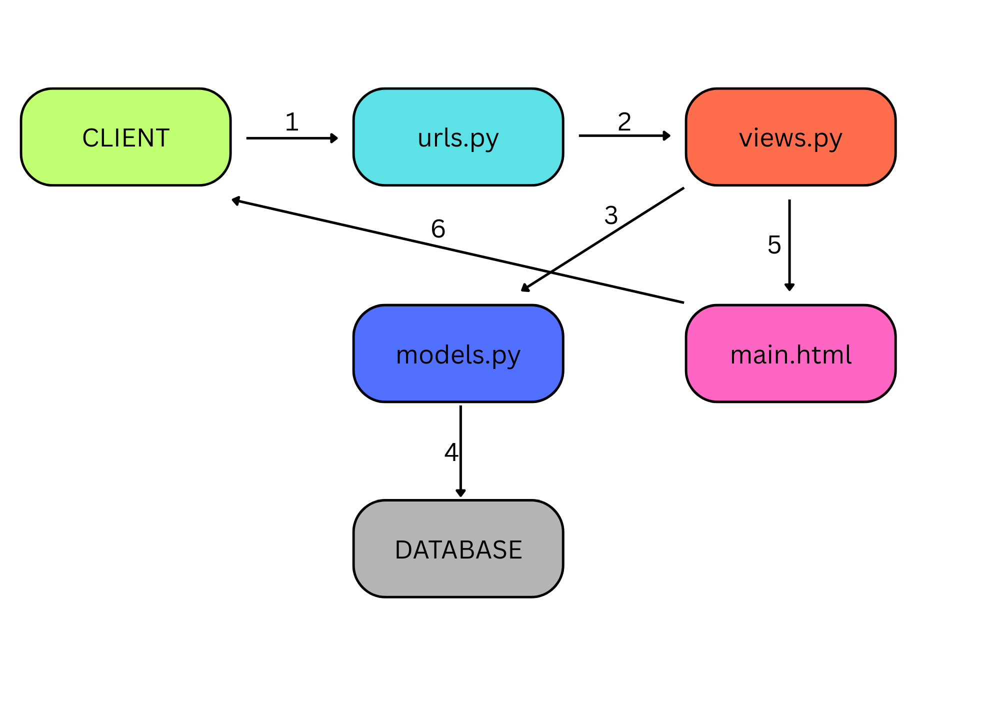

# pbp-c-adadis
<b>1. Jelaskan bagaimana cara kamu mengimplementasikan checklist di atas secara step-by-step (bukan hanya sekadar mengikuti tutorial).</b>

Untuk mengimplementasikan checklist tersebut, langkah pertama yang saya lakukan adalah membuat proyek Django baru menggunakan perintah django-admin startproject <nama_proyek>, kemudian saya masuk ke folder proyek dan membuat aplikasi dengan nama main menggunakan python manage.py startapp main. Setelah aplikasi dibuat, saya mendaftarkannya ke dalam INSTALLED_APPS pada file settings.py agar bisa dijalankan. Selanjutnya, saya melakukan routing pada proyek dengan menambahkan path menuju aplikasi main di dalam urls.py proyek utama. 

Pada tahap berikutnya, saya mendefinisikan sebuah model bernama Product di file models.py dalam aplikasi main, dengan atribut wajib sesuai instruksi: name (CharField), price (IntegerField), description (TextField), thumbnail (URLField), category (CharField), dan is_featured (BooleanField). Setelah itu, saya melakukan migrasi dengan python manage.py makemigrations dan python manage.py migrate agar model tersimpan di database. Kemudian, saya membuat sebuah fungsi di views.py yang akan merender template HTML sederhana berisi nama aplikasi serta identitas saya, dan membuat file HTML di folder templates untuk menampilkannya. Supaya fungsi tersebut dapat diakses, saya menambahkan routing di urls.py aplikasi main dengan menggunakan path() yang mengarahkan URL tertentu ke fungsi pada views.py. 

Setelah aplikasi berjalan di lokal, saya menyiapkan deployment ke PWS (Pacil Web Service) dengan cara "create new project" lalu edit environs menjadi isi dari .env.prod. Setelah itu saya langsung melakukan command yang telah disediakan oleh PWS dan akhirnya web saya punya domain yang dapat diakses kapan saja

Terakhir, saya membuat file README.md yang berisi menjawab pertanyaan-pertanyaan yang akan saya jawab

<b>2. Buatlah bagan yang berisi request client ke web aplikasi berbasis Django beserta responnya dan jelaskan pada bagan tersebut kaitan antara urls.py, views.py, models.py, dan berkas html.</b>

BAGAN: 
PENJELASAN:
1. Client → urls.py
Pengguna (client) mengirimkan request melalui browser, misalnya mengetik URL tertentu. Request ini pertama kali diteruskan ke urls.py, yang bertugas mencocokkan URL dengan fungsi view yang sesuai.
 
2. urls.py → views.py
Setelah URL dikenali, Django akan mengarahkan request tersebut ke fungsi yang ada di views.py, tempat logika utama aplikasi berada.
 
3. views.py → models.py
Jika logika dalam view membutuhkan data dari database (misalnya menampilkan daftar produk), maka views.py akan memanggil models.py untuk melakukan query data.
 
4. models.py → Database
models.py bertindak sebagai perantara antara kode Python dan database. Ia menerjemahkan instruksi dari view menjadi query SQL yang dijalankan ke dalam Database untuk mengambil atau menyimpan data.
 
5. views.py → main.html
Setelah mendapatkan data, views.py mempersiapkannya dan mengirimkannya ke template HTML (misalnya main.html). Template ini bertugas merender data menjadi tampilan yang dapat dipahami oleh pengguna.
 
6. main.html → Client
Hasil render berupa halaman HTML dikembalikan sebagai response ke Client, sehingga pengguna bisa melihat informasi sesuai permintaan mereka di browser.

<b>3. Jelaskan peran settings.py dalam proyek Django!</b>

- Konfigurasi Dasar Proyek
Berisi pengaturan inti seperti SECRET_KEY, DEBUG, dan ALLOWED_HOSTS. Misalnya, SECRET_KEY dipakai untuk keamanan (hashing, session, CSRF), DEBUG mengatur apakah aplikasi berjalan dalam mode pengembangan atau produksi, sedangkan ALLOWED_HOSTS menentukan domain/host mana saja yang boleh mengakses aplikasi.
 
- Manajemen Aplikasi
Pada bagian INSTALLED_APPS, semua aplikasi yang dipakai dalam proyek didaftarkan, termasuk aplikasi bawaan Django (seperti django.contrib.admin) maupun aplikasi buatan sendiri (misalnya main). Kalau tidak terdaftar di sini, aplikasi tidak akan dikenali oleh Django.
 
- Pengaturan Middleware
MIDDLEWARE adalah daftar komponen yang menangani request dan response secara berlapis (seperti keamanan, session, autentikasi). File settings.py menentukan middleware apa saja yang digunakan, misalnya AuthenticationMiddleware atau CsrfViewMiddleware.
 
- Konfigurasi Database
Di bagian DATABASES, kita menentukan jenis database (PostgreSQL, MySQL, SQLite, dsb.), host, username, password, dan nama database. Tanpa ini, model yang ada di models.py tidak bisa tersimpan atau di-query.
 
- Pengaturan Template & Static Files
settings.py juga mengatur letak folder template (HTML), file statis (CSS, JS, gambar), dan media (file upload). Hal ini penting agar data bisa ditampilkan dengan benar di browser.
 
- Internasionalisasi & Time Zone
Berisi pengaturan bahasa (LANGUAGE_CODE) dan zona waktu (TIME_ZONE). Misalnya bisa diset ke "id-ID" dan "Asia/Jakarta" agar sesuai dengan kebutuhan lokal.
 
- Konfigurasi Tambahan
Bisa mencakup email backend (untuk notifikasi), logging, autentikasi kustom, hingga integrasi dengan layanan pihak ketiga.

<b>4. Bagaimana cara kerja migrasi database di Django?</b>

Migrasi database di Django bekerja sebagai jembatan antara kode Python pada models.py dengan struktur tabel nyata di dalam database. Prosesnya dimulai ketika developer mendefinisikan atau mengubah model, misalnya menambahkan kelas Product dengan field tertentu. Perubahan ini masih sebatas kode Python, sehingga belum berdampak pada database. Ketika perintah python manage.py makemigrations dijalankan, Django membaca perubahan tersebut lalu membuat file migrasi berisi instruksi dalam bentuk Python yang menggambarkan apa saja yang perlu dilakukan pada database, seperti membuat tabel baru atau menambah kolom. File migrasi ini kemudian diterjemahkan ke dalam perintah SQL ketika python manage.py migrate dijalankan, sehingga database benar-benar diperbarui sesuai dengan model. Django juga mencatat semua migrasi yang sudah dijalankan dalam tabel khusus bernama django_migrations, sehingga sistem dapat melacak versi migrasi yang sudah diterapkan dan menghindari konflik. Dengan cara ini, setiap kali ada perubahan model di masa depan, developer hanya perlu menjalankan makemigrations dan migrate agar database tetap sinkron dengan kode tanpa harus menulis SQL secara manual.

<b>5. Menurut Anda, dari semua framework yang ada, mengapa framework Django dijadikan permulaan pembelajaran pengembangan perangkat lunak?</b>

Django sering dijadikan permulaan karena menyediakan paket lengkap: ada ORM, autentikasi, admin panel, hingga migrasi database tanpa harus pasang banyak library tambahan. Ia juga mendorong praktik terbaik sejak awal (struktur MVT, keamanan bawaan, skalabilitas) dan punya dokumentasi serta komunitas yang sangat ramah pemula. Dengan begitu, pemula bisa langsung membangun aplikasi nyata dengan standar industri. Kekurangannya, Django agak “kaku” sehingga pemula cepat produktif tapi mungkin kurang paham detail internal dibanding framework ringan seperti Flask.

<b>6. Apakah ada feedback untuk asisten dosen tutorial 1 yang telah kamu kerjakan sebelumnya?</b>

Tidak ada, asisten dosen sduah sangat membantu serta menjawab pertanyaan-pertanyaan tentang Django yang sekiranya membuat saya bingung